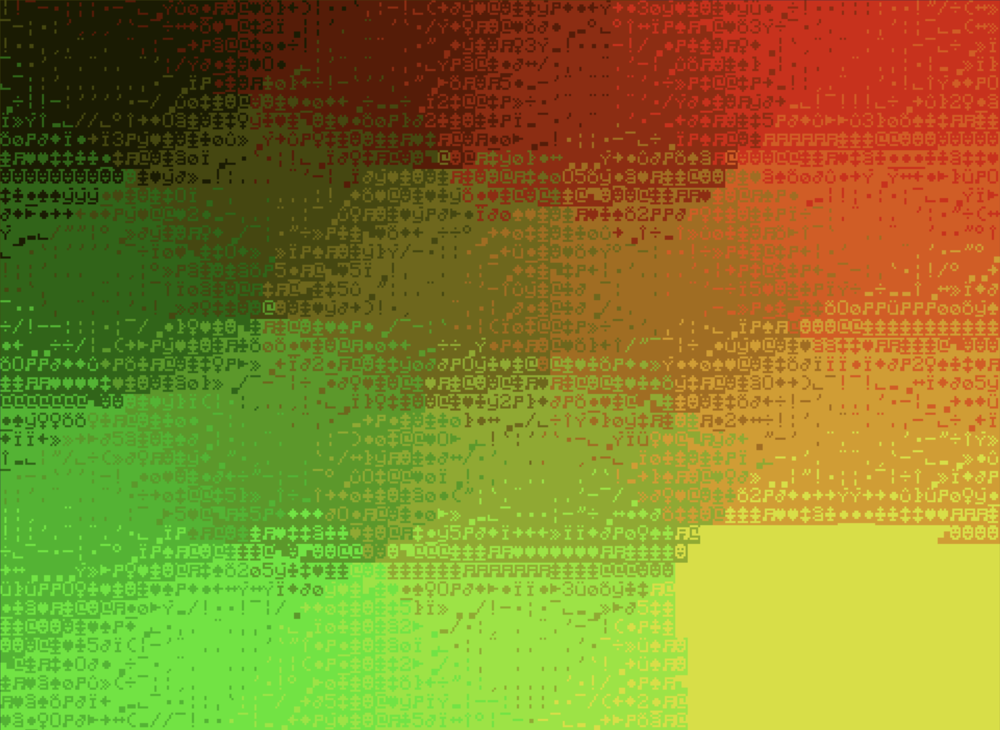

# ComBox
## About
An all-in-one rendering system for CC:Tweaked.  
All about render quality and customizability.


### Summary
- Design philosophy
- Setup & use
- Definitions
- Architecture
- Core classes
- Combinators
- Credits & stuff


## Design philosophy

The main focuses of ComBox are **quality**, **customizability**, **modularity** and **ease of use**.  

Customizability in the form of :
- many settings everywhere
- support to use different rendering modes in different parts of the screen
- support to use shaders everywhere  

Modularity in the form of :
- separate files for different "classes"
- support to integrate custom rendering "modes" (named *combinators*, explained later)
- support for different image file types (and the ability to add more)
- comments in all main files to allow for easy reuse and modifications.
  
These points are sometimes prioritised over maximal optimisation, leading to some processes being slower than other solutions.  
Though you can achieve quite good speeds by avoiding or restricting some quality-focused features. 

## Definitions

**Color**
> An r,g,b,a color.  
> Usualy represented as an instance of Color or an index in a palette.

**Palette**
> Array of 16 (or less) colors.
  
**Image**
> A grid of (usualy) colors, and an instance of ImageHandler.
  
**Pixel**
> The value at a specific point (u,v) of an image (usualy a color).
  
**Media**
> Data, usualy an image, comming from a file/external source.
  
**Texel**
> A single spot (x,y) on a CC:T term/monitor,  
> Able to display a single character, with a text and background color.
  
**Combination**
> What to display on a specific texel.  
> Table of 3 chars like :  
> [character to display, palette index in hex format for the text color, palette index in hex format for the background color]
  
**Render**
> A grid of combinations representing what to display on the texels of the term/monitor.  
> Generated by the Renderer:render function.
  
**Smoothness/Roughness of a render**
> How much visual noise there is on a render.  
> Basicaly comes down to the difference between the text and background color in texels.  
> A render is rough when there is a big difference in color in it's texels.  
> A render is smooth when there is very little difference in color in it's texels.

## Setup & use
- Using the *installer script* :  
    **Setup**  
        Install the combox installer script with this command: ```wget https://pastebin.com/raw/MAC87pxn comboxInstaller.lua```  
        or just download *comboxInstaller.lua* from github and drag and drop it into your computer  
        then simply run *comboxInstaller.lua*.

    **Use**  
    You just have to put your path to your combox installation (/combox/ by default) followed by the module you want to require
    ```lua
    local Renderer = require "combox.Renderer"
    ``` 
    There are 4 modules you can require :
    - Renderer: used to render images and siplay them to a monitor or terminal
    - ImageHandler: used to create store images
    - Color: used to store colors
    - MediaParser: used to read media, currently only png and qoi images are supported  

    >to import a combinator and use it you juste have to require it from the combinators folder,  
    >**ex:** local FastCharCombinator = require "combox.combinators.FastCharCombinator":new()  

**General Use**

To use ComBox in our program we first need to create a **Renderer** instance.  
A Renderer instance needs a few things, mainly where to display and how to display it, 
we tell it where to display with the *term* parameter,  
> By default this will simply be term (the terminal) but it can also be a monitor peripheral.  

we can also define the origin, width and height of our display.  
This is done with px and py for the origin and sx and sy for width and height.  
> These parameters are optional and will default to fill the whole screen.  

We now need to tell it how to display things, this is done with the *mask* and *combinators* parameters.  
The mask is an ImageHandler of Combinators that defines what combinator gets used where.  
> By default *mask* is an ImageHandler filled with the first combinator in the combinators list.  

Combinators are all initialized with a "new" function, it takes itself as a first parameter  
and a table of parameters as the second parameter.  
> combinator:new() = combinator.new(combinator)  
> you should go look into each combinator's file for more information on what parameters exist for it. 

Once we have our Renderer instance we need to create an ImageHandler instance.  
> You can create an ImageHandler from media with the MediaParser class.  

To create an ImageHandler instance we can use the ImageHandler:new function. 
It takes a width and a height as parameters.
> By default pixels of the image will be set to black or Color(0,0,0,1).  

Once we have our image we can render and display it.
> The size of the image doesn't have to match the renderer.  

Here is a small exemple script that displays uvs :  
```lua
    local FastCharCombinator = require("combox.combinators.FastCharCombinator"):new() -- we create a new FastCharCombinator instance, we don't give it a parameters table so it will use the default
    local Renderer = require "combox.Renderer"
    local screen = Renderer:new{ -- we create the object that will allow us to display images to a screen
        combinators = {FastCharCombinator} -- we define what combinator we want to use
    }
    local ImageHandler = require "combox.ImageHandler"
    local image = ImageHandler:new(screen.sx,screen.sy) -- we create an image with the same size as our screen
    image:process(function(self,u,v) -- we apply a shader to our image, see ImageHandler.lua for more info
        return combox.Color(u,v) -- equivalent to Color:new(u,v,0,1)
    end) 

    screen:render(image) -- we calculate all the combination to display on our screen
    .display() -- we display the combinations from render
```

**Result :**


## Architecture
The actual rendering is done by "combinators" objects.  
These tell the system what combination to put at each point or the render.


## Core classes

### Color
Usage  
```lua
local Color = require "Color" -- you can also use combox.Color if you require combox
--                r   g   b   a
local rgb = Color(0.1,0.4,0.8,1) -- same as Color:new(0.1,0.4,0.8,1)
local rgbShort = Color(0.5,1) -- same as Color(0.5,1,0,1)
local hex = Color("#FF0000") -- same as Color(1,0,0,1)
local hexAlpha = Color("#00FF0000") -- same as Color(0,1,0,0)
```
### ImageHandler
### MediaParser
### Renderer


## Combinators

### SimpleCombinator 
### CharCombinator 
### FastCharCombinator 
### MathCharCombinator 
### SquarePixelCombinator 
### FlowCombinator 
### VerboseCombinator 
### ASCIICombinator 


## Credits & stuff

Project made by [hexell](https://github.com/hexelll/) (hexell_dev on Discord) and [TO](https://github.com/TheoALBERT) (to_noaccentavailable on Discord).

If you have questions, ideas, critisism, or need any help, come talk about it in the [Minecraft computer mods Discord](https://discord.gg/minecraft-computer-mods-477910221872824320).

With inspiration from other CC:T renderers (pixelbox, bixelbox, ShrekBox).


